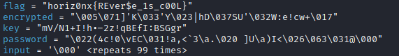

# CTF - Reverse - Random Password [150 pts]
## Méthode avec GDB

Au préalabe on récupère le pseudo-code avec __Ghidra__ :

```c
int main(int argc,char **argv)

{
  int iVar1;
  time_t tVar2;
  size_t sVar3;
  char input [100];
  char password [32];
  char key [25];
  char encrypted [25];
  char flag [25];
  int i_1;
  int i;
  
  tVar2 = time((time_t *)0x0);
  srand((uint)tVar2);
  flag._0_8_ = 0;
  flag._8_8_ = 0;
  flag._16_8_ = 0;
  flag[24] = '\0';
  encrypted._0_8_ = 0x59271b4b275d3905;
  encrypted._8_8_ = 0x2755531f44687c13;
  encrypted._16_8_ = 0x2b776321653a571a;
  encrypted[24] = '\x0f';
  key._0_8_ = 0x21492b314e2f566d;
  key._8_8_ = 0x4271217a322d2e68;
  key._16_8_ = 0x674753423a496645;
  key[24] = 'r';
  i = 0;
  while( true ) {
    sVar3 = strlen(key);
    if (sVar3 <= (ulong)(long)i) break;
    flag[i] = key[i] ^ encrypted[i];
    i = i + 1;
  }
  i_1 = 0;
  while (i_1 < 0x1e) {
    iVar1 = rand();
    password[i_1] = (char)iVar1 + (char)(iVar1 / 100) * -100;
    i_1 = i_1 + 1;
  }
  password[31] = '\0';
  printf("Please enter password: ");
  __isoc99_scanf(&DAT_00102020,input);
  iVar1 = strcmp(password,input);
  if (iVar1 == 0) {
    printf("Good job here is your flag: %s\n",flag);
  }
  else {
    puts("Incorrect password");
  }
  return 0;
}
```
On constate que le résultat de la variable __flag__ est mis en mémoire bien avant de rentrer notre valeur.  
Donc si on met un point d'arrêt sur notre __scanf__ nous pourrons récupérer le flag directement.  
Lancement du binaire avec __GDB__ et on désassemble main() :

```bash
$ gdb rev
(gdb) disass main
```
On constate que notre scanf se trouve à la 346ème instruction après notre main() :   
  
On place donc notre breakpoint et on lance le programme :  
```bash
(gdb) b *main+346
(gdb) r
```
On a plus qu'à afficher le contenu des variables locales :  
```bash
(gdb) info locals
```
  
